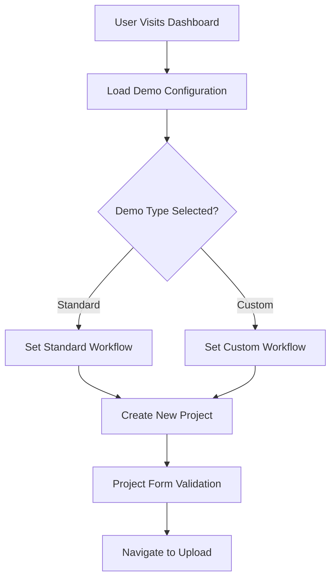
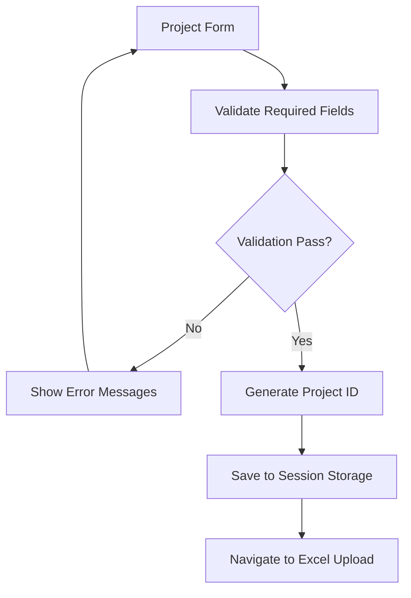
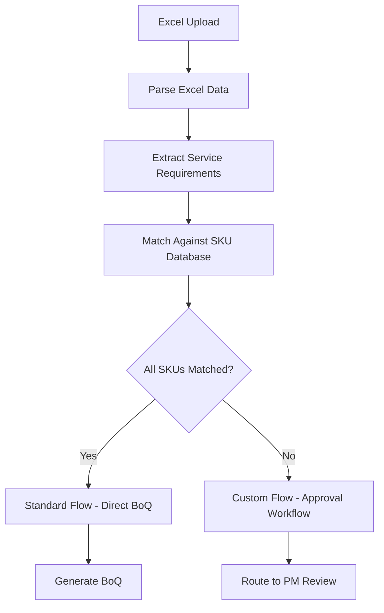
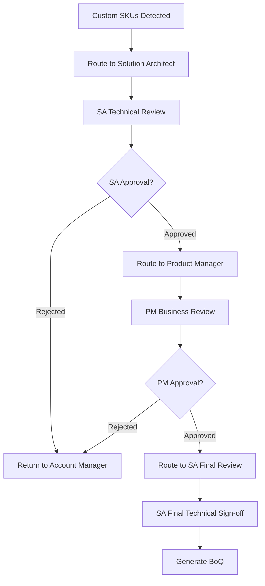

# Sify Cloud Demo - Logic and Flow Documentation

## 📋 **Table of Contents**

1. [System Architecture](#system-architecture)
2. [Data Flow Overview](#data-flow-overview)
3. [Component Hierarchy](#component-hierarchy)
4. [State Management](#state-management)
5. [Workflow Logic](#workflow-logic)
6. [Business Rules](#business-rules)
7. [Technical Implementation](#technical-implementation)
8. [Error Handling](#error-handling)
9. [Performance Optimizations](#performance-optimizations)
10. [Future Enhancements](#future-enhancements)

---

## 🏗️ **System Architecture**

### **High-Level Architecture**
```
┌─────────────────┐    ┌─────────────────┐    ┌─────────────────┐
│   Dashboard     │    │  Project Mgmt   │    │   Workflow      │
│   - Demo Config │    │  - Creation     │    │   - Approvals   │
│   - Statistics  │    │  - Validation   │    │   - Routing     │
└─────────────────┘    └─────────────────┘    └─────────────────┘
         │                       │                       │
         └───────────────────────┼───────────────────────┘
                                 │
                    ┌─────────────────┐
                    │   Data Model    │
                    │   - Storage     │
                    │   - Validation  │
                    │   - Business    │
                    └─────────────────┘
```

### **Technology Stack**
- **Frontend**: React 18 with Hooks
- **Routing**: React Router v6
- **State Management**: Local State + Session Storage
- **Styling**: Tailwind CSS + Custom Components
- **Build Tool**: Vite
- **Deployment**: Static Hosting (Vercel/Netlify compatible)

---

## 🔄 **Data Flow Overview**

### **1. Demo Initialization Flow**


### **2. Project Creation Flow**


### **3. SKU Matching Flow**


### **4. Approval Workflow Flow**


---

## 🧩 **Component Hierarchy**

### **Main Application Structure**
```
App.jsx
├── ErrorBoundary.jsx
├── PersonaSwitcher.jsx
└── Router
    ├── Dashboard.jsx
    │   ├── DemoControls.jsx
    │   └── ProjectList.jsx
    ├── NewProject.jsx
    ├── ExcelUpload.jsx
    ├── SKUMatchingEngine.jsx
    ├── ProductManagerReview.jsx
    ├── SolutionArchitectVetting.jsx
    ├── BoQGenerated.jsx
    ├── ApprovalWorkflow.jsx
    └── ProjectDetails.jsx
```

### **Component Responsibilities**

#### **Dashboard.jsx**
- **Purpose**: Main landing page and demo configuration
- **State**: Demo type selection, project statistics
- **Logic**: 
  - Manages demo type selection (Standard/Custom)
  - Displays project statistics and metrics
  - Provides navigation to create new projects
  - Handles demo reset functionality

#### **NewProject.jsx**
- **Purpose**: Project creation and initial data collection
- **State**: Form data, validation errors, contract terms
- **Logic**:
  - Validates required fields (customer, project name, email)
  - Handles contract term selection with discount calculation
  - Generates unique project IDs
  - Saves project data to session storage

#### **ExcelUpload.jsx**
- **Purpose**: File upload and SKU matching orchestration
- **State**: Upload progress, processing status, matched/unmatched items
- **Logic**:
  - Handles file upload (supports .xlsx and .csv)
  - Parses Excel data and extracts service requirements
  - Performs SKU matching against price-book database
  - Routes to appropriate workflow based on matching results
  - Adds essential services automatically

#### **SKUMatchingEngine.jsx**
- **Purpose**: Core business logic for SKU matching
- **State**: SKU database, matching rules, processing results
- **Logic**:
  - Implements fuzzy matching algorithm for service descriptions
  - Categorizes items as standard vs custom
  - Applies business rules for automatic matching
  - Generates matching confidence scores

#### **ProductManagerReview.jsx**
- **Purpose**: Product Manager approval workflow
- **State**: Custom SKUs, pricing decisions, approval status
- **Logic**:
  - Displays both standard and custom items for context
  - Allows pricing adjustments for custom SKUs
  - Implements approval/rejection workflow
  - Routes to next stage based on decisions

#### **SolutionArchitectVetting.jsx**
- **Purpose**: Technical validation and architecture review
- **State**: Technical specifications, resource sizing, approval status
- **Logic**:
  - Technical validation of custom services
  - Resource sizing and dependency analysis
  - Architecture documentation and BOM creation
  - Technical risk assessment

#### **BoQGenerated.jsx**
- **Purpose**: Final Bill of Quantities with editing capabilities
- **State**: BoQ items, pricing totals, edit mode, bulk resources
- **Logic**:
  - Displays comprehensive service breakdown
  - Implements edit functionality for quantities and prices
  - Calculates totals with contract discounts and GST
  - Shows bulk resource summary (CPU/RAM/Storage)
  - Handles approval submission

---

## 🗄️ **State Management**

### **Data Model Structure**
```javascript
// Project Data Model
const projectModel = {
  id: "PROJ-{timestamp}",
  customerName: "string",
  projectName: "string",
  contactEmail: "string",
  phoneNumber: "string",
  contractTerm: "MONTHLY|QUARTERLY|ANNUAL|THREE_YEAR",
  projectType: "NEW|MIGRATION|EXPANSION",
  timeline: "URGENT|NORMAL|FLEXIBLE",
  status: "DRAFT|PENDING_SA_REVIEW|PENDING_PM_REVIEW|...",
  demoType: "STANDARD|CUSTOM",
  createdAt: "timestamp",
  updatedAt: "timestamp",
  
  // Excel Data
  excelData: [
    {
      description: "string",
      quantity: "number",
      specifications: "object"
    }
  ],
  
  // SKU Matching Results
  matchedItems: [
    {
      description: "string",
      sku: "string",
      internalCode: "string",
      category: "string",
      quantity: "number",
      unitPrice: "number",
      totalPrice: "number",
      type: "standard|custom",
      essential: "boolean",
      autoAdded: "boolean"
    }
  ],
  
  // Workflow Data
  approvals: {
    sa: { status: "pending|approved|rejected", notes: "string", timestamp: "date" },
    pm: { status: "pending|approved|rejected", notes: "string", timestamp: "date" },
    finance: { status: "pending|approved|rejected", notes: "string", timestamp: "date" }
  },
  
  // Pricing
  pricing: {
    subtotal: "number",
    contractDiscount: "number",
    discountAmount: "number",
    tax: "number",
    total: "number"
  }
}
```

### **Session Storage Strategy**
```javascript
// Storage Keys
const STORAGE_KEYS = {
  DEMO_TYPE: 'sify_demo_type',
  CURRENT_PROJECT: 'sify_current_project',
  PROJECT_LIST: 'sify_project_list',
  USER_PERSONA: 'sify_user_persona'
}

// Storage Operations
const storage = {
  save: (key, data) => sessionStorage.setItem(key, JSON.stringify(data)),
  load: (key) => JSON.parse(sessionStorage.getItem(key) || 'null'),
  remove: (key) => sessionStorage.removeItem(key),
  clear: () => sessionStorage.clear()
}
```

---

## ⚙️ **Workflow Logic**

### **1. Demo Type Selection Logic**
```javascript
const getDemoWorkflow = (demoType) => {
  switch(demoType) {
    case 'STANDARD':
      return {
        skuMatchingStrategy: 'FORCE_MATCH_ALL',
        workflow: 'DIRECT_TO_BOQ',
        expectedDuration: '5-10 minutes',
        services: STANDARD_SERVICES
      }
    case 'CUSTOM':
      return {
        skuMatchingStrategy: 'REALISTIC_MATCHING',
        workflow: 'APPROVAL_REQUIRED',
        expectedDuration: '15-20 minutes',
        services: MIXED_SERVICES
      }
  }
}
```

### **2. SKU Matching Algorithm**
```javascript
const performSKUMatching = (excelData, demoType) => {
  const results = {
    matched: [],
    unmatched: [],
    confidence: 0
  }
  
  excelData.forEach(item => {
    const match = findBestMatch(item.description, SKU_DATABASE)
    
    if (demoType === 'STANDARD') {
      // Force all items to match for demo purposes
      results.matched.push(createMatchedItem(item, match || getDefaultSKU(item)))
    } else {
      // Realistic matching with some items unmatched
      if (match && match.confidence > 0.8) {
        results.matched.push(createMatchedItem(item, match))
      } else {
        results.unmatched.push(createCustomSKU(item))
      }
    }
  })
  
  // Add essential services automatically
  results.matched.push(...getEssentialServices())
  
  return results
}
```

### **3. Workflow Routing Logic**
```javascript
const determineNextStep = (project, currentStep, userAction) => {
  const { status, demoType } = project
  
  switch(currentStep) {
    case 'SKU_MATCHING':
      if (demoType === 'STANDARD' || project.unmatchedItems.length === 0) {
        return 'BOQ_GENERATION'
      } else {
        return 'SA_REVIEW'
      }
      
    case 'SA_REVIEW':
      if (userAction === 'APPROVE') {
        return 'PM_REVIEW'
      } else {
        return 'AM_REVISION'
      }
      
    case 'PM_REVIEW':
      if (userAction === 'APPROVE') {
        return 'SA_FINAL_REVIEW'
      } else {
        return 'AM_REVISION'
      }
      
    case 'SA_FINAL_REVIEW':
      return 'BOQ_GENERATION'
      
    case 'BOQ_GENERATION':
      return 'PROPOSAL_READY'
  }
}
```

### **4. Approval Workflow State Machine**
```javascript
const WORKFLOW_STATES = {
  DRAFT: {
    allowedTransitions: ['PENDING_SA_REVIEW', 'CANCELLED'],
    requiredRole: 'ACCOUNT_MANAGER'
  },
  PENDING_SA_REVIEW: {
    allowedTransitions: ['PENDING_PM_REVIEW', 'REJECTED', 'DRAFT'],
    requiredRole: 'SOLUTION_ARCHITECT'
  },
  PENDING_PM_REVIEW: {
    allowedTransitions: ['PENDING_SA_FINAL', 'REJECTED', 'DRAFT'],
    requiredRole: 'PRODUCT_MANAGER'
  },
  PENDING_SA_FINAL: {
    allowedTransitions: ['PENDING_FINANCE', 'REJECTED'],
    requiredRole: 'SOLUTION_ARCHITECT'
  },
  PENDING_FINANCE: {
    allowedTransitions: ['APPROVED', 'REJECTED'],
    requiredRole: 'FINANCE_ADMIN'
  },
  APPROVED: {
    allowedTransitions: ['PROPOSAL_GENERATED'],
    requiredRole: 'ACCOUNT_MANAGER'
  }
}
```

---

## 📊 **Business Rules**

### **1. Pricing Rules**
```javascript
const PRICING_RULES = {
  CONTRACT_DISCOUNTS: {
    MONTHLY: 0,
    QUARTERLY: 5,
    ANNUAL: 15,
    THREE_YEAR: 25
  },
  
  GST_RATE: 18,
  
  APPROVAL_THRESHOLDS: {
    AUTO_APPROVE: 100000,      // Below 1L - auto approve
    MANAGER_APPROVE: 500000,   // 1L-5L - manager approval
    DIRECTOR_APPROVE: 1000000, // 5L-10L - director approval
    BOARD_APPROVE: Infinity    // Above 10L - board approval
  },
  
  DISCOUNT_LIMITS: {
    ACCOUNT_MANAGER: 10,
    PRODUCT_MANAGER: 20,
    BUSINESS_HEAD: 35
  }
}
```

### **2. Essential Services Logic**
```javascript
const getEssentialServices = (projectType, services) => {
  const essentials = []
  
  // Always add backup for data protection
  if (hasDataServices(services)) {
    essentials.push(BACKUP_SERVICE)
  }
  
  // Add VPN for remote access
  if (hasComputeServices(services)) {
    essentials.push(VPN_SERVICE)
  }
  
  // Add internet connectivity
  essentials.push(INTERNET_SERVICE)
  
  // Add monitoring for production workloads
  if (projectType === 'PRODUCTION') {
    essentials.push(MONITORING_SERVICE)
  }
  
  return essentials.map(service => ({
    ...service,
    essential: true,
    autoAdded: true,
    reasoning: getComplianceReasoning(service)
  }))
}
```

### **3. Bulk Resource Calculation**
```javascript
const calculateBulkResources = (boqItems) => {
  const bulk = {
    totalVMs: 0,
    totalCPU: 0,
    totalRAM: 0,
    totalStorage: 0
  }
  
  boqItems.forEach(item => {
    if (item.category === 'Compute') {
      bulk.totalVMs += item.quantity
      bulk.totalCPU += extractCPU(item.description) * item.quantity
      bulk.totalRAM += extractRAM(item.description) * item.quantity
    }
    
    if (item.category === 'Storage') {
      bulk.totalStorage += extractStorage(item.description) * item.quantity
    }
  })
  
  return {
    ...bulk,
    efficiency: calculateResourceEfficiency(bulk),
    recommendations: getOptimizationRecommendations(bulk)
  }
}
```

---

## 🛠️ **Technical Implementation**

### **1. Component Communication Pattern**
```javascript
// Parent-Child Communication
const Dashboard = () => {
  const [demoType, setDemoType] = useState('STANDARD')
  
  return (
    <DemoControls 
      demoType={demoType}
      onDemoTypeChange={setDemoType}
    />
  )
}

// Context for Global State
const ProjectContext = createContext()

const ProjectProvider = ({ children }) => {
  const [currentProject, setCurrentProject] = useState(null)
  
  const value = {
    currentProject,
    updateProject: (updates) => {
      setCurrentProject(prev => ({ ...prev, ...updates }))
      saveToStorage('current_project', { ...currentProject, ...updates })
    }
  }
  
  return (
    <ProjectContext.Provider value={value}>
      {children}
    </ProjectContext.Provider>
  )
}
```

### **2. Navigation and Routing**
```javascript
// Route Configuration
const routes = [
  { path: '/', element: <Dashboard /> },
  { path: '/new-project', element: <NewProject /> },
  { path: '/excel-upload', element: <ExcelUpload /> },
  { path: '/pm-review', element: <ProductManagerReview /> },
  { path: '/sa-vetting', element: <SolutionArchitectVetting /> },
  { path: '/boq-generated', element: <BoQGenerated /> },
  { path: '/project/:id', element: <ProjectDetails /> }
]

// Navigation Logic
const navigateToNextStep = (project) => {
  const nextStep = determineNextStep(project)
  const route = getRouteForStep(nextStep)
  navigate(route, { state: { projectId: project.id } })
}
```

### **3. Data Persistence Strategy**
```javascript
// Session Storage Wrapper
class ProjectStorage {
  static save(project) {
    try {
      const serialized = JSON.stringify(project)
      sessionStorage.setItem(`project_${project.id}`, serialized)
      this.updateProjectList(project.id)
    } catch (error) {
      console.error('Failed to save project:', error)
      throw new Error('Storage quota exceeded')
    }
  }
  
  static load(projectId) {
    try {
      const data = sessionStorage.getItem(`project_${projectId}`)
      return data ? JSON.parse(data) : null
    } catch (error) {
      console.error('Failed to load project:', error)
      return null
    }
  }
  
  static updateProjectList(projectId) {
    const list = this.getProjectList()
    if (!list.includes(projectId)) {
      list.push(projectId)
      sessionStorage.setItem('project_list', JSON.stringify(list))
    }
  }
}
```

---

## 🚨 **Error Handling**

### **1. Error Boundary Implementation**
```javascript
class ErrorBoundary extends Component {
  constructor(props) {
    super(props)
    this.state = { hasError: false, error: null }
  }
  
  static getDerivedStateFromError(error) {
    return { hasError: true, error }
  }
  
  componentDidCatch(error, errorInfo) {
    console.error('Error caught by boundary:', error, errorInfo)
    
    // Log to monitoring service
    this.logError(error, errorInfo)
  }
  
  render() {
    if (this.state.hasError) {
      return <ErrorFallback error={this.state.error} />
    }
    
    return this.props.children
  }
}
```

### **2. Validation Strategy**
```javascript
// Form Validation
const validateProject = (data) => {
  const errors = {}
  
  if (!data.customerName?.trim()) {
    errors.customerName = 'Customer name is required'
  }
  
  if (!data.projectName?.trim()) {
    errors.projectName = 'Project name is required'
  }
  
  if (!isValidEmail(data.contactEmail)) {
    errors.contactEmail = 'Valid email is required'
  }
  
  return {
    isValid: Object.keys(errors).length === 0,
    errors
  }
}

// Business Logic Validation
const validateWorkflowTransition = (currentState, targetState, userRole) => {
  const allowedStates = WORKFLOW_STATES[currentState]?.allowedTransitions || []
  const requiredRole = WORKFLOW_STATES[targetState]?.requiredRole
  
  if (!allowedStates.includes(targetState)) {
    throw new Error(`Invalid transition from ${currentState} to ${targetState}`)
  }
  
  if (requiredRole && userRole !== requiredRole) {
    throw new Error(`Insufficient permissions. Required: ${requiredRole}`)
  }
  
  return true
}
```

---

## ⚡ **Performance Optimizations**

### **1. Component Optimization**
```javascript
// Memoization for expensive calculations
const BoQGenerated = () => {
  const [boqItems, setBoqItems] = useState([])
  
  const totals = useMemo(() => {
    return calculateTotals(boqItems)
  }, [boqItems])
  
  const bulkResources = useMemo(() => {
    return calculateBulkResources(boqItems)
  }, [boqItems])
  
  // Prevent unnecessary re-renders
  const handleItemEdit = useCallback((itemId, updates) => {
    setBoqItems(prev => prev.map(item => 
      item.id === itemId ? { ...item, ...updates } : item
    ))
  }, [])
  
  return (
    <div>
      {/* Component JSX */}
    </div>
  )
}
```

### **2. Data Loading Strategy**
```javascript
// Lazy loading for large datasets
const loadProjectData = async (projectId) => {
  try {
    // Check cache first
    const cached = ProjectStorage.load(projectId)
    if (cached) return cached
    
    // Load from server if needed
    const data = await fetchProjectData(projectId)
    ProjectStorage.save(data)
    
    return data
  } catch (error) {
    console.error('Failed to load project data:', error)
    throw error
  }
}

// Debounced search for better UX
const useDebounce = (value, delay) => {
  const [debouncedValue, setDebouncedValue] = useState(value)
  
  useEffect(() => {
    const handler = setTimeout(() => {
      setDebouncedValue(value)
    }, delay)
    
    return () => clearTimeout(handler)
  }, [value, delay])
  
  return debouncedValue
}
```

---

## 🔮 **Future Enhancements**

### **1. Planned Features**
- **Real-time Collaboration**: Multiple users working on same project
- **Advanced Analytics**: Detailed reporting and insights
- **API Integration**: Connect to actual Sify systems
- **Mobile App**: Native mobile experience
- **AI-Powered Recommendations**: Smart service suggestions

### **2. Technical Improvements**
- **State Management**: Migrate to Redux Toolkit for complex state
- **Testing**: Comprehensive unit and integration tests
- **Performance**: Virtual scrolling for large datasets
- **Accessibility**: WCAG 2.1 AA compliance
- **Internationalization**: Multi-language support

### **3. Architecture Evolution**
```javascript
// Future Architecture with Microservices
const services = {
  projectService: 'https://api.sify.com/projects',
  pricingService: 'https://api.sify.com/pricing',
  workflowService: 'https://api.sify.com/workflow',
  notificationService: 'https://api.sify.com/notifications'
}

// Event-Driven Architecture
const eventBus = new EventEmitter()

eventBus.on('project.created', (project) => {
  notificationService.notify('project_created', project)
  analyticsService.track('project_creation', project)
})
```

---

## 📝 **Summary**

This documentation provides a comprehensive overview of the Sify Cloud Demo system's logic and flow. The architecture is designed to be:

- **Modular**: Each component has a single responsibility
- **Scalable**: Easy to add new features and workflows
- **Maintainable**: Clear separation of concerns and well-documented code
- **User-Friendly**: Intuitive navigation and error handling
- **Business-Aligned**: Reflects real-world enterprise processes

The system successfully demonstrates both simple (Standard) and complex (Custom) cloud ordering workflows while maintaining professional UX standards and enterprise-grade functionality.

