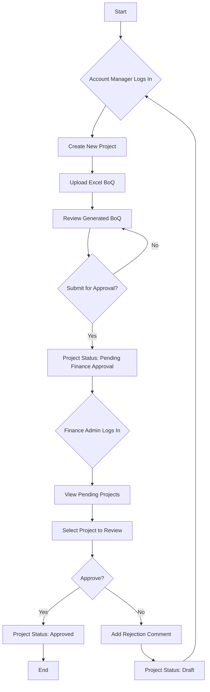

# Design Document: Standard Flow

## 1. System Architecture

The application will be a single-page application (SPA) built with React. For the MVP, there will be no backend. All data and application state will be managed client-side using `localStorage`.

### Key Technologies:
- **Framework:** React 18+ with Vite
- **UI Library:** Shadcn UI
- **Routing:** `react-router-dom`
- **State Management:** React Context API for global state (like current user persona) and component state for forms.

## 2. Component Design

The UI will be broken down into the following key components:

- **`App.jsx`:** The main component that sets up routing.
- **`Dashboard.jsx`:** The main view for both Account Managers and Finance Admins, displaying a list of projects.
- **`NewProject.jsx`:** A modal or page with a form to create a new project.
- **`ProjectDetails.jsx`:** A detailed view of a single project, including its BoQ.
- **`ExcelUpload.jsx`:** Component to handle file upload and parsing.
- **`BoQTable.jsx`:** A reusable component to display the Bill of Quantities.
- **`PersonaSwitcher.jsx`:** A utility component to switch between user personas for demo purposes.

## 3. Data Flow Diagram (Standard Flow)



## 4. State Management

The core of our application state will be a list of `projects`. This will be stored in `localStorage` under a key like `sify-projects`.

### Project Object Structure:
```javascript
{
  id: 'PROJ-1672531200000',
  customerName: 'ACME Corp',
  projectName: 'Cloud Migration',
  contactEmail: 'contact@acme.com',
  status: 'Draft', // Draft, Pending Finance Approval, Approved
  flowType: 'standard',
  boqItems: [
    {
      sku: 'CI-2C4R50S-LINUX',
      internalCode: 'VM004',
      description: 'Linux VM 2vCPU 4GB',
      quantity: 5,
      unitPrice: 2000,
      totalPrice: 10000
    },
    // ... other items
  ],
  comments: [],
  createdDate: '2023-01-01T00:00:00.000Z',
  lastModified: '2023-01-01T00:00:00.000Z'
}
```

### Global State (Context):
- `currentPersona`: To keep track of the currently logged-in user type.
- `projects`: The list of all projects.
- `setProjects`: A function to update the projects list.

## 5. API Specification (Client-Side)

Since there's no backend, we will define a "service" layer of functions that interact with `localStorage`.

- `getProjects()`: Returns all projects from `localStorage`.
- `getProject(projectId)`: Returns a single project by its ID.
- `addProject(projectData)`: Adds a new project to the list.
- `updateProject(projectId, updates)`: Updates an existing project.
- `deleteProject(projectId)`: Removes a project from the list. 