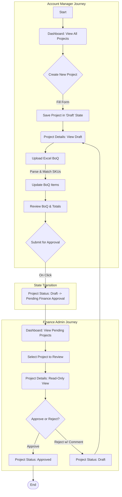

# Design Document: Standard Flow

## 1. System Architecture

The application will be a client-side rendered Single-Page Application (SPA) built with React and Vite. For the MVP, it will operate without a backend database. All application data and state will be managed client-side and persisted in the browser's `localStorage` to simulate a multi-session experience.

### Key Technologies:
- **Framework:** React 18+ with Vite for fast, modern web development.
- **Language:** JavaScript (ES6+).
- **UI Library:** Shadcn UI, for a consistent and accessible component library.
- **Routing:** `react-router-dom` for managing client-side navigation.
- **State Management:** A combination of React Context API for global state (like the current user persona and the master project list) and component-level state (`useState`, `useReducer`) for local UI state and forms.

## 2. Component Design

The UI will be broken down into a hierarchy of reusable components.

- **`App.jsx`:** The root component. It initializes the React Router, sets up the main layout (including the `PersonaSwitcher`), and provides the global state context to its children.

- **`PersonaSwitcher.jsx`:** A utility component, likely in the header, that allows the user to switch between `Account Manager` and `Finance Admin` personas. This is a key feature for demonstrating the different roles in the MVP.

- **`Dashboard.jsx`:** The main landing page after "login".
  - **Responsibility:** Displays a list of projects. For the AM, it shows all projects. For the FA, it is filtered to show only projects with a `Pending Finance Approval` status. It includes a "New Project" button.
  - **Data:** Receives the list of all projects from the global context.

- **`NewProject.jsx`:** A modal or dedicated page for project creation.
  - **Responsibility:** Renders a form with controlled components for capturing new project details. Handles form validation (e.g., all fields required) and submission.
  - **Data:** On submit, it calls the `addProject` function from the `projectService` to update the global state.

- **`ProjectDetails.jsx`:** A detailed view of a single project.
  - **Responsibility:** Displays all metadata for a project. It conditionally renders action buttons (`Upload BoQ`, `Submit for Approval`, `Approve`, `Reject`) based on the current persona and project status. It also renders the `BoQTable` and any comments.
  - **Data:** Fetches the specific project data using a URL parameter (e.g., `/project/:id`) and the `getProject` service function.

- **`ExcelUpload.jsx`:** A component dedicated to handling file uploads.
  - **Responsibility:** Provides a file input and processes the selected `.xlsx` file. It uses a library like `xlsx` to parse the data and then updates the current project's `boqItems`.
  - **Data:** Takes the `projectId` as a prop and uses the `updateProject` service function.

- **`BoQTable.jsx`:** A reusable component to display the Bill of Quantities.
  - **Responsibility:** Renders a table of BoQ items, including columns for SKU, description, quantity, unit price, and total price. It also calculates and displays the grand total.
  - **Data:** Receives the `boqItems` array as a prop.

## 3. Data Flow Diagram (Standard Flow)

This diagram illustrates the user journey and system state changes for the standard approval workflow.



## 4. State Management

The client-side state will be managed in two tiers:

### Global State (React Context)
A `ProjectContext` will provide the following to the entire component tree:
- `projects`: The complete list of all project objects.
- `currentPersona`: The currently selected user role (`'Account Manager'` or `'Finance Admin'`).
- `actions`: A set of memoized functions for interacting with the projects list (e.g., `addProject`, `updateProjectStatus`). This encapsulates the `localStorage` logic.

### Local State (`useState`)
- Form inputs in `NewProject.jsx`.
- Loading/error states for file uploads in `ExcelUpload.jsx`.
- UI state like which modal is open or which project is selected.

### Project Object Structure (Detailed)
```javascript
{
  // Core Fields
  id: 'PROJ-1672531200000', // Unique ID, e.g., 'PROJ-' + Date.now()
  customerName: 'ACME Corp',
  projectName: 'Cloud Migration',
  contactEmail: 'contact@acme.com',
  
  // Workflow
  status: 'Draft', // Enum: 'Draft', 'Pending Finance Approval', 'Approved'
  flowType: 'standard',
  
  // Financials
  boqItems: [
    {
      sku: 'CI-2C4R50S-LINUX',
      internalCode: 'VM004',
      description: 'Linux VM 2vCPU 4GB',
      quantity: 5,
      unitPrice: 2000,
      totalPrice: 10000
    }
  ],
  totals: {
    subtotal: 10000,
    discount: 0, // Not used in MVP
    tax: 0, // Not used in MVP
    total: 10000
  },
  
  // Communication & History
  comments: [
    {
      persona: 'Finance Admin',
      text: 'Budget exceeds quarter allocation. Please revise.',
      timestamp: '2023-01-02T10:00:00.000Z'
    }
  ],
  
  // Metadata
  createdDate: '2023-01-01T00:00:00.000Z',
  lastModified: '2023-01-02T10:00:00.000Z'
}
```

## 5. Client-Side Service Module (`projectService.js`)

To keep the data logic separate from the UI components, a service module will be created to abstract `localStorage` interactions. This also makes it easier to swap in a real API later.

- `getProjects()`: Parses and returns all projects from `localStorage`.
- `getProject(projectId)`: Retrieves a single project by ID.
- `addProject(projectData)`: Creates a new project, adds it to the list, and saves it.
- `updateProject(projectId, updates)`: Merges updates into an existing project and saves.
- `_commit(projects)`: A private utility function to stringify and save the entire project list to `localStorage`. 